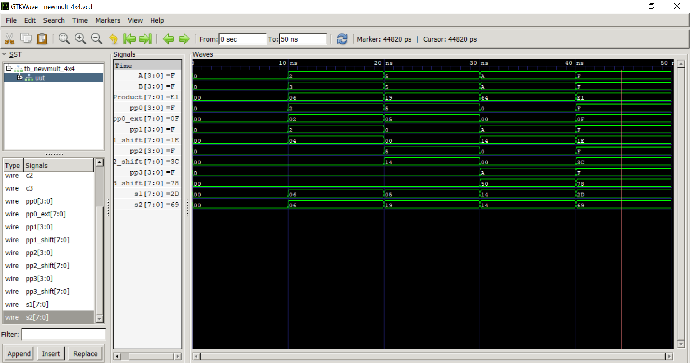

# 4x4 Structural Multiplier using Verilog HDL

## Overview

This project implements a 4x4 Structural Multiplier using Verilog HDL. The design is developed using a structural modeling approach by integrating Full Adders and Ripple Carry Adders (RCA) to generate the final multiplication result.

## Features

* Structural Verilog Design
* Modular Design Approach
* Full Adder Implementation
* 8-bit Ripple Carry Adder (RCA)
* Testbench for Functional Verification
* Simulation using Icarus Verilog
* Waveform Analysis using GTKWave

## Project Files

| File Name        | Description                   |
| ---------------- | ----------------------------- |
| full_adder.v     | Full Adder Module             |
| rca_8bit.v       | 8-bit Ripple Carry Adder      |
| newmult_4x4.v    | Top Module for 4x4 Multiplier |
| tb_newmult_4x4.v | Testbench Module              |

## Design Methodology

1. Generate partial products using AND operations.
2. Add partial products using Full Adders.
3. Use Ripple Carry Adder architecture for intermediate additions.
4. Produce final 8-bit multiplication output.

## Tools Used

* Verilog HDL
* Icarus Verilog
* GTKWave
* Visual Studio Code
* Git & GitHub

## Simulation

The design was verified using a dedicated testbench and simulated using Icarus Verilog. Waveforms were analyzed in GTKWave to confirm correct multiplication functionality.

## Future Improvements

* Parameterized Multiplier Design
* Wallace Tree Multiplier
* Booth Multiplier Implementation
* FPGA Implementation and Verification

## Author

Faraaz Shaikh

B.Tech Electronics Engineering (VLSI Design & Technology)

## Simulation Waveform

The functionality of the 4x4 Structural Multiplier was verified using Icarus Verilog and GTKWave.

